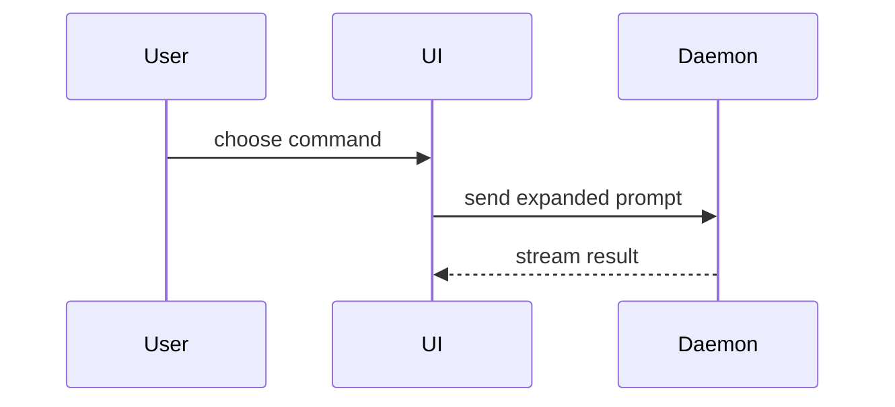

# Show Me

> Read only the representation needed. These examples are illustrative, not repository facts.

<!-- Adapted from humanlayer/skills/plugins/show-me/skills/show-me/SKILL.md (MIT). See ../LICENSE. -->

Skip the preamble. Pick the smallest truthful visual that makes the key point clear, place it next to the short explanation it supports, and omit irrelevant calls, files, states, or components.

## Choose the representation

```text
logic / algorithm       -> pseudocode or state flow
runtime control flow    -> call tree or sequence diagram
module responsibility   -> shallow file tree
UI composition          -> component tree
before vs after         -> diff-shaped sketch
dense UI/layout concept -> one focused HTML artifact
```

Prefer plain text over Mermaid when both communicate the same thing. Ground repository visuals in inspected paths and symbols; label assumptions instead of inventing structure.

## Pseudocode

```text
on(save)
  if content is unchanged
    return cached result
  write new content
  return fresh result
```

## Call tree

```text
submitForm
  createSession
    persistPrompt
    launchAgent
  navigateToSession
```

## Component tree

Include state and module boundaries only when they matter:

```tsx
<SessionPage> (apps/example/src/routes/session.tsx)
  useSessionEvents()
  <SessionToolbar>
    <RunSkillButton> (packages/ui)
```

## File tree

Show responsibility, not an exhaustive inventory:

```text
src/
├── commands/       # parses user actions
├── sessions/       # owns session state
└── transport/      # sends API requests
```

## Mermaid

Use for multiple participants, branches, or state transitions that are hard to follow in text:



Keep node labels concrete and the diagram small enough to read without zooming.

## Diff-shaped sketches

Use a diff when the surrounding shape already exists and the point is what changes.

Component change:

```diff
 <SessionPage>
   useSessionEvents()
   <SessionToolbar>
+    <RunSkillButton />
   <SessionTimeline>
+    <SkillResultCard />
```

File-layout change:

```diff
 src/
 ├── commands/
+│   └── show-me.ts       # expands the command
 ├── sessions/
-└── transport.ts
+└── transport/
+    ├── client.ts
+    └── stream.ts
```

Control-flow change:

```diff
 on(save)
-  write content
+  if content is unchanged
+    return cached result
+  write new content
+  invalidate cache
```

Show the complete block instead when most of it is new, omitted context would hide ownership/order, or the user needs a copyable target:

```ts
function expandSkill(command: string): string {
  const skillName = command.slice(1)
  return `use the ${skillName} skill`
}
```

## Focused HTML artifact

For a visual UI, responsive layout, state comparison, infographic, or concept too dense for Mermaid, create one self-contained HTML file.

Requirements:

- one question or concept per artifact
- real labels and representative data
- responsive desktop/mobile layout
- semantic HTML and readable keyboard/focus behavior
- product-consistent typography, spacing, and components when repository evidence exists
- no external dependency unless the environment already provides it
- no decorative complexity that obscures the explanation

Open the file with the environment's supported file-opening tool when available. Otherwise report its exact path. Do not claim it was opened when it was only written.

## Final check

Before presenting a visual, verify:

- it answers the user's actual question
- direction, ownership, and ordering are unambiguous
- code/path labels are factual or explicitly marked as illustrative
- the visual is smaller than the prose it replaces
- no second representation repeats the same information without adding value

Use one representation by default; combine several only when each resolves a different part of the question.
